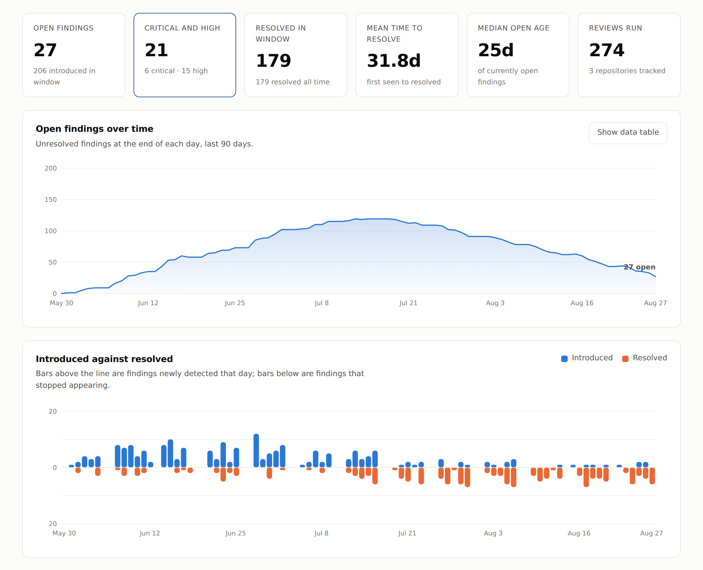
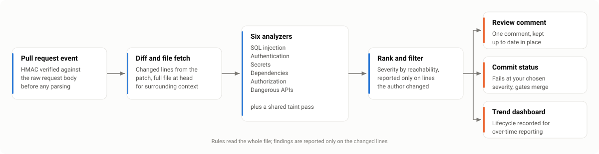
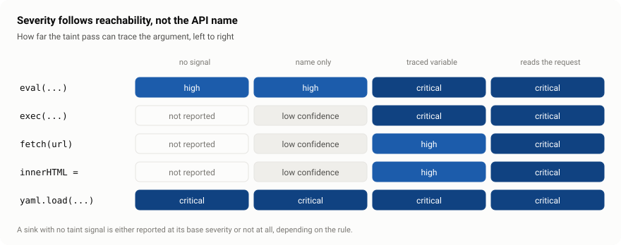
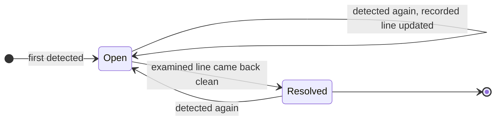
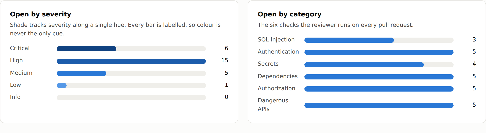

# AI Security Code Reviewer

Connect a GitHub repository and every pull request gets a security review before a
human reads it. The reviewer analyses only the lines the author changed, posts its
findings as a single comment it keeps up to date, reports a commit status that can
gate the merge, and records everything so a dashboard can show whether your
vulnerability count is going up or down.

<picture>
  <source media="(prefers-color-scheme: dark)" srcset="docs/images/dashboard-dark.png">
  
</picture>

<sub>The dashboard, with the sample history from `npm run seed`. Ninety days of a
team finding a backlog and then working it down.</sub>

## How it works

<picture>
  <source media="(prefers-color-scheme: dark)" srcset="docs/images/pipeline-dark.svg">
  
</picture>

## What it looks for

Six categories, each with its own analyzer:

| Category | What it catches |
| --- | --- |
| **SQL injection** | Queries built by concatenation, template interpolation or `%`-formatting instead of parameter binding; raw ORM escape hatches (`$queryRawUnsafe`, `knex.raw`) reached by request data. |
| **Authentication** | JWTs decoded without verification, `alg: none`, expiry checks disabled, passwords stored with a fast hash, plaintext password comparison, timing-unsafe secret comparison, non-cryptographic randomness for tokens, TLS verification switched off, session cookies missing their flags, auth bypasses gated on `NODE_ENV`. |
| **Secrets** | Provider-specific credential formats (AWS, GitHub, Slack, Stripe, Google, SendGrid, Twilio, npm, private keys, connection strings with inline passwords) plus an entropy-gated generic check, and credential-bearing files added to version control. |
| **Dependencies** | Version ranges that permit a published advisory, unbounded ranges, plain-HTTP and unpinned-git sources, install hooks that fetch and execute code, and likely typosquats. |
| **Authorization** | Records fetched by a client-supplied ID with no ownership predicate (IDOR), state-changing routes with no auth middleware, mass assignment from the request body, privilege levels read from the request, public object ACLs, wildcard IAM policies, security groups open to the internet, wildcard CORS with credentials, and path traversal. |
| **Dangerous APIs** | `eval` and dynamic code evaluation, shell execution built from untrusted input, unsafe deserialization (`pickle`, `yaml.load`, `unserialize`, `ObjectInputStream`), HTML injection sinks, SSRF, weak ciphers and broken hashes, XXE, archive extraction without path validation, prototype-pollution sinks, debug mode, and regex denial of service. |

Languages: JavaScript, TypeScript, Python, Java, Go, Ruby, PHP, C#, SQL, shell,
Terraform, YAML and JSON. Rules are pattern-and-heuristic based, so there is
nothing to compile and no per-language toolchain to install.

## How it decides what to report

Three design choices do most of the work in keeping the signal-to-noise ratio
usable.

**Rules read the whole file; findings are reported only on changed lines.** An
analyzer needs surrounding context to tell a bug from a non-bug - whether an
ownership check exists elsewhere in the handler, whether `verify()` is called
near the `decode()`. So the full post-change file is fetched and analysed, and
the diff is used to filter the *output*. You get context-aware analysis without
being handed a backlog of pre-existing issues on every pull request.

**Severity depends on reachability, not just on the API called.** A shared taint
pass finds expressions that read request data and follows them through
straight-line assignments in the file. `eval(x)` is a high-severity finding;
`eval(req.body.expr)` is critical. Functions that are only dangerous with
untrusted input - `fetch`, `exec`, `innerHTML` - are not reported at all without
a taint signal.

<picture>
  <source media="(prefers-color-scheme: dark)" srcset="docs/images/severity-matrix-dark.svg">
  
</picture>

**Findings are content-addressed.** Each one carries a fingerprint derived from
the rule, the path and the normalised source text, so moving code or
reformatting a file does not resurrect an issue that was already triaged, and
the tool can tell you which findings this pull request *introduced* rather than
just which ones exist.

That fingerprint is what makes a lifecycle possible, and the lifecycle is what
the trend charts are computed from:



The middle transition is the one that is easy to get wrong. A pull-request scan
only examines the lines the author touched, so "not detected this time" is not
the same as "fixed" - a finding elsewhere in a touched file was simply never
looked at. Resolution therefore requires that the finding's own line was inside
the examined range, and line matching is exact: closing a finding that is still
in the code costs the vulnerability, while leaving a stale one open costs a
moment of attention.

## Model-assisted triage

The analyzers answer "does this code match a dangerous shape?". That is the right
question for a scanner and the wrong question for a reviewer, because the shape is
often present and harmless: the ownership check lives two functions up, the
interpolated value is a compile-time constant, the `exec` argument comes from a
config file. An optional second pass reads the surrounding code and answers the
question you actually care about.

For each finding it returns a verdict, an explanation written in terms of your
code, and a fix that names your variables:

| Verdict | Effect |
| --- | --- |
| **confirmed** | Reachable and real. Rendered with the reviewed explanation in place of the rule's generic one. |
| **likely** | Probably real, not provable from the excerpt. |
| **unclear** | Not enough context to judge — flagged for a human rather than guessed at. |
| **refuted** | The surrounding code makes it a non-issue. Moved out of the blocking set into a labelled section. |

### It cannot make the review worse

That constraint drove most of the design.

- **A refuted finding is not deleted.** It moves into a collapsed section with the
  reasoning, and stops blocking the merge — so a wrong refutation costs attention,
  not a missed vulnerability. `AI_DROP_REFUTED=true` changes that once you trust
  the pass on your codebase.
- **Severity moves by at most one step, and only on a high-confidence verdict.**
  Without the cap, one confident-sounding response could turn a critical injection
  into an informational note.
- **Any failure is a no-op.** A missing key, a 500, a timeout, a malformed
  response, an invented fingerprint — every one of these leaves the deterministic
  findings exactly as they were, and the comment says the pass did not run rather
  than quietly looking un-triaged.
- **Findings the model cannot usefully judge are never sent.** A provider-format
  credential match is decided by the format itself, and judging it would mean
  sending the credential somewhere.

### What leaves your network

Enabling this sends source code to a third-party API. That is your decision to
make; the amount and content is ours to control.

- Only a **bounded window** around each finding, merged per file so a cluster does
  not send the same lines repeatedly. Never whole files.
- Every excerpt is **scrubbed** first: provider token formats, credential
  assignments and connection-string passwords are replaced with `[redacted]`,
  whether or not the secrets rule flagged them. The integration tests assert on
  the actual request body — an AWS key four lines above a flagged query does not
  appear in the payload.
- Only findings at or above `AI_MIN_SEVERITY`, capped at `AI_MAX_FINDINGS` per
  review.

Set `AI_BASE_URL` to route through your own gateway. Triage is off unless both
`ANTHROPIC_API_KEY` and `AI_MODEL` are set; a half-configured setup is reported
at startup rather than failing silently.

## The dashboard

`GET /` renders vulnerability trends: open findings per day, findings introduced
against findings resolved, breakdowns by severity and category, mean time to
resolve, median age of open findings, per-repository comparison, the most
frequent rules, and the oldest outstanding issues. Filter by repository and by
window (7 to 180 days).

It is a single self-contained page: charts are drawn as SVG by an inline script,
with no external requests at all, which is the least a security tool can do. It
follows the viewer's light/dark preference and has an explicit toggle, every
chart has a text-table equivalent, and the palette was checked with a colour
validator rather than by eye - severity uses a single-hue ordinal ramp because
the obvious red-amber-green version is indistinguishable under the most common
form of colour blindness.

<picture>
  <source media="(prefers-color-scheme: dark)" srcset="docs/images/breakdown-dark.png">
  
</picture>

JSON is available at `/api/stats`, `/api/findings` and `/api/scans`, all
accepting `?repo=` and `?days=`.

### Try it without connecting a repository

```bash
npm install
npm run seed                                        # writes data/demo.sqlite
DATABASE_PATH=data/demo.sqlite ALLOW_INSECURE_WEBHOOK=true npm start
```

Then open <http://localhost:3000>. The generator is deterministic, so the same
command always produces the same history - which is what makes the screenshots
above reproducible rather than a one-off artefact. Pass `--days` and `--seed` to
vary it. None of the data is real; it exists so the charts have something to
show.

The diagrams in this README are generated too, from one description per figure,
so the light and dark variants cannot drift apart:

```bash
npm run diagrams
```

## Running it

```bash
npm install
cp .env.example .env      # then fill in GITHUB_TOKEN and GITHUB_WEBHOOK_SECRET
npm run build
npm start
```

For development, `npm run dev` runs the server with reload. `npm test` runs the
suite; `npm run typecheck` runs the compiler without emitting.

### Connecting a repository

1. Generate a token with `repo` scope (or a fine-grained token with read access
   to code and pull requests, and write access to pull requests and commit
   statuses). Put it in `GITHUB_TOKEN`.
2. Invent a long random webhook secret and put it in `GITHUB_WEBHOOK_SECRET`.
3. In the repository settings, add a webhook pointing at
   `https://your-host/webhook`, content type `application/json`, with the same
   secret, subscribed to **Pull requests**.
4. Open a pull request. The reviewer posts a `pending` status, reviews, then
   updates the status and comments.

To re-review a pull request without waiting for a push:

```bash
curl -X POST https://your-host/api/review \
  -H "x-review-token: $GITHUB_WEBHOOK_SECRET" \
  -H 'content-type: application/json' \
  -d '{"owner":"acme","repo":"app","pullNumber":42}'
```

### Configuration

Every option has a working default; see `.env.example` for the full list with
explanations. The ones worth knowing:

| Variable | Default | Effect |
| --- | --- | --- |
| `FAIL_ON_SEVERITY` | `high` | Severity at which the commit status fails. `never` makes the reviewer advisory only. |
| `MIN_SEVERITY` | `low` | Findings below this are never reported. |
| `DISABLED_RULES` | *(empty)* | Comma-separated rule IDs or category names to skip. |
| `INCLUDE_TESTS` | `false` | Whether test and fixture paths are scanned. |
| `MAX_FILES_PER_PR` | `300` | Pull requests above this are skipped rather than reviewed badly. |
| `AI_MODEL` | *(unset)* | Model identifier, or `auto`. With `ANTHROPIC_API_KEY`, enables triage. |
| `AI_MIN_SEVERITY` | `medium` | Severity floor for triage - the main cost dial. |
| `AI_DROP_REFUTED` | `false` | Whether a refuted finding is removed rather than labelled. |

### Suppressing a finding

When a rule is wrong about your code, say so in the code:

```js
// security-review-ignore-next-line authorization/missing-ownership-check
const invoice = await Invoice.findByPk(req.params.id); // scoped by the router guard above
```

`security-review-ignore` on the same line works too, and omitting the rule ID
suppresses every rule on that line. The directive may sit above an explanatory
comment rather than immediately above the code, so the reason and the waiver can
live together. Prefer naming the rule, and prefer leaving a reason - the next
reader needs it more than the scanner does.

For a file whose *content describes* dangerous code rather than being dangerous
code - a rule table, a pattern fixture, a document of unsafe examples - a header
directive in the first 30 lines waives the named rules for the whole file:

```ts
// security-review-ignore-file dangerous-api, sql-injection
```

The rule list is required: an unqualified file-level waiver would silence
everything, which is too blunt to grant by accident. The analyzers in this
repository use exactly this mechanism on themselves, which is why a self-scan
comes back clean.

Markdown, reStructuredText and AsciiDoc are treated as documentation: the
code-analysis rules do not run against them, because prose describing `eval` is
not a call to `eval`. The secrets rule still does, because a key pasted into a
README is a real key.

## Security of the reviewer itself

A tool that reads your source and holds a token with write access has to be held
to its own standard.

- Webhook payloads are authenticated with an HMAC over the **raw request body**,
  compared in constant time, before any parsing happens. Every rejection returns
  the same opaque 401, so the endpoint does not tell a prober which part they got
  wrong.
- The webhook body is size-capped: an unbounded body on an unauthenticated
  endpoint is a free memory-exhaustion primitive.
- The process refuses to start without a webhook secret unless
  `ALLOW_INSECURE_WEBHOOK=true` is set explicitly, so a dashboard-only
  deployment is a deliberate choice rather than an accident.
- Detected credentials are redacted before they reach a comment, the database or
  a log line. Log output goes through a redaction pass keyed on both field names
  and credential formats.
- The dashboard escapes every interpolated value, neutralises `</script>` inside
  the inlined JSON, and ships a strict content security policy.
- The manual review endpoint requires the shared secret, so it cannot be used to
  make the service issue authenticated GitHub requests for a stranger.

## Layout

```
src/
  analysis/
    types.ts          Severity, category and finding vocabulary
    engine.ts         Runs the rules, dedupes, ranks, applies suppressions
    diff.ts           Unified-diff parsing and line/position mapping
    source.ts         Language detection, fingerprinting, entropy, helpers
    taint.ts          Shared single-file taint reasoning
    advisories.ts     Offline advisory snapshot and version comparison
    rules/            One analyzer per category
  ai/
    client.ts         Model access and `auto` model resolution
    excerpt.ts        Bounded, credential-scrubbed code excerpts
    triage.ts         The triage pass, its schema and its guardrails
  github/
    webhook.ts        Signature verification and event routing
    client.ts         REST wrapper
    reviewer.ts       End-to-end review of one pull request
    comment.ts        Comment and commit-status rendering
  storage/
    database.ts       Schema and finding lifecycle reconciliation
    queries.ts        Read-side queries for the dashboard
  dashboard/
    page.ts           Server-rendered HTML
    client.ts         Inline SVG charts
    theme.ts          Validated palette
  config.ts, server.ts, index.ts

scripts/
  seed-demo.ts        Deterministic sample history for the dashboard
  build-diagrams.ts   Generates the README figures as light/dark SVG pairs

docs/images/          Screenshots and generated figures
```

## Advisory data

`src/analysis/advisories.ts` carries a curated snapshot of high-impact published
advisories so a dependency bump can be judged without a network round trip on
the review path. It is a floor, not a substitute for a full vulnerability
database - point it at a live source (OSV, the GitHub Advisory Database) for
exhaustive coverage.

## License

MIT.
